<div align="center">

# 🛡️ Suraksha Chain

### AI-Assisted, Cross-Channel Fraud Prevention System

**Preventing fraud before money moves—by correlating scam calls with payment intent in real time**

[](https://www.typescriptlang.org/)
[](https://nodejs.org/)
[](https://redis.io/)
[](https://ethereum.org/)
[](https://hardhat.org/)
[](https://sepolia.dev/)
[](https://nodemon.io/)

🧪 **Smart contracts are tested on Hardhat local testnet for development.**  
🌐 **Sepolia testnet is recommended for public testing and backend integration.**


[Features](#-key-features) • [Architecture](#-architecture--flow) • [API](#-api-reference) • [Security](#-security--privacy) • [Roadmap](#-future-roadmap)

</div>

---

##  The Problem

Digital fraud is evolving faster than traditional defenses can adapt. Current fraud prevention systems suffer from critical gaps:

| **Challenge** | **Impact** |
|--------------|-----------|
| **Digital Arrest Scams** | Victims coerced into transferring lakhs within minutes through impersonation of law enforcement |
| **Fragmented Detection** | Call blockers and bank fraud systems operate in isolation—no cross-channel correlation |
| **Post-Transaction Detection** | Banks flag fraud *after* money has moved, when recovery is nearly impossible |
| **Zero Temporal Context** | UPI apps have no knowledge of suspicious calls received seconds before a transaction |

> **The Critical Gap:** A scammer calls pretending to be police. The victim, terrified, immediately opens their UPI app and transfers ₹2,00,000. The bank has no idea a scam call just happened. The call blocker has no idea money is about to move.

**Suraksha Chain bridges this gap.**

---

##  Architecture & Flow

```mermaid
graph TB
    A[ Incoming Call] --> B{Call Analysis Engine}
    B --> C[ AI Analysis - Google Gemini]
    B --> D[ Heuristic Rules]
    
    C --> E[Risk Score Generator]
    D --> E
    
    E --> F[(Redis Memory - TTL: 15min)]
    
    G[💳 UPI Transaction Initiated] --> H[Risk Assessment Engine]
    
    H --> F
    H --> I[⛓️ Blockchain Registry - Ethereum]
    
    F -.->|Recent Call Context| H
    I -.->|Historical Patterns| H
    
    H --> J{Risk Level}
    
    J -->|HIGH| K[🚨 Alert User+ Delay Transaction]
    J -->|MEDIUM| L[⚠️ Warning Display]
    J -->|LOW| M[✅ Proceed Normally]
    
    K --> N{User Action}
    L --> N
    
    N -->|Confirm Fraud| O[Report to Registry]
    N -->|Override| P[Complete Transaction]
    
    O --> I

    style F fill:#DC382D,stroke:#fff,color:#fff
    style I fill:#627EEA,stroke:#fff,color:#fff
    style K fill:#ff4444,stroke:#fff,color:#fff
    style M fill:#44ff44,stroke:#333,color:#333
```


### How It Works

1. **Call Analysis Phase**: When a user receives a call, the system performs hybrid AI analysis (Gemini API) + rule-based heuristics to detect scam patterns
2. **Temporal Memory**: Risk context is stored in Redis with a 15-minute TTL, keyed by hashed phone identifiers
3. **Pre-Transaction Check**: Before UPI transfer, the system queries Redis for recent suspicious activity linked to the recipient
4. **Risk Scoring**: Multi-signal risk engine combines call analysis, blockchain registry, and behavioral patterns
5. **User Protection**: High-risk transactions trigger warnings, delays, and educational prompts—*before* money moves

---

## 🔧 Technical Stack

<div align="center">

| Layer | Technologies |
|:-----:|:------------|
| **Backend** |    |
| **Dev Tooling** |  |
| **AI/ML** |  |
| **Cache** |  |
| **Blockchain** |    |

</div>

---

##  Key Features

<table>
<tr>
<td width="50%">

###  Hybrid AI Call Analysis
Combines rule-based heuristics with Google Gemini LLM for nuanced scam detection. Analyzes patterns like urgency keywords, authority impersonation, and payment demands without relying solely on expensive API calls.

</td>
<td width="50%">

###  Temporal Risk Memory
Redis-backed short-term memory (15-min TTL) links phone identifiers to risk events. Enables cross-channel correlation between incoming calls and outgoing payments—the critical innovation.

</td>
</tr>
<tr>
<td width="50%">

###  Explainable Risk Scoring
Multi-factor risk engine provides transparent scores with human-readable explanations:
- Recent suspicious call detected (45%)
- Phone in fraud registry (30%)
- Unusual timing (15%)
- Behavioral anomaly (10%)

</td>
<td width="50%">

###  Blockchain Fraud Registry
Immutable, privacy-preserving registry on Ethereum stores hashed fraud patterns. Enables community-driven intelligence without exposing PII. Validator roles ensure data quality.

</td>
</tr>
<tr>
<td colspan="2">

###  Privacy-First Design
- Phone numbers stored as SHA-256 hashes only
- No call recordings or transcripts retained
- TTL-based automatic data expiry (15 minutes)
- Minimal AI API usage to reduce data exposure
- User consent required at every step

</td>
</tr>
</table>

---

##  API Reference

### Analyze Call Endpoint

**POST** `/api/v1/analyze-call`

Analyzes incoming call metadata to detect potential scam patterns.

```json
{
  "userId": "u1",
  "transcript": "This is CBI. Your account will be frozen unless you pay now."
}
```

**Response:**
```json
{
    "scamDetected": true,
    "scamType": "DIGITAL_ARREST",
    "confidence": 0.95,
    "signals": [
        "Authority Impersonation",
        "Fear Tactic",
        "Urgency",
        "Financial Threat"
    ],
    "analysisSource": "HYBRID_AI"
}
```

---

### Check UPI Transaction

**POST** `/api/v1/check-upi`

Evaluates transaction risk by correlating with recent call analysis and blockchain registry.
```json
{
  "userId": "u1",
  "upiId": "random@upi",
  "amount": 5000
}

```

**Response (High Risk):**
```json
{
    "riskScore": 0.7,
    "riskLevel": "HIGH",
    "reasons": [
        "Payment to a new recipient",
        "Recent DIGITAL_ARREST scam call detected"
    ],
    "recommendedAction": "DELAY"
}
```

---

##  Security & Privacy

<details>
<summary><b>Privacy Guarantees</b></summary>

<br>

- **No PII on Blockchain**: Only cryptographic hashes (SHA-256) of phone numbers and identifiers stored
- **Automatic Data Expiry**: Redis keys expire after 15 minutes—no long-term tracking or surveillance
- **Minimal AI Surface**: Heuristics handle 70% of detection; LLM invoked only for edge cases
- **User Consent**: Explicit opt-in required for fraud reporting and registry participation
- **Data Minimization**: No call recordings, transcripts, or sensitive metadata retained beyond analysis

</details>

<details>
<summary><b>Fail-Safe Defaults</b></summary>

<br>

- **Never Block Transactions**: System warns and delays, but final decision always stays with the user
- **Graceful Degradation**: If Redis/blockchain unavailable, falls back to heuristic-only mode
- **False Positive Handling**: Users can override warnings with additional confirmation step
- **Rate Limiting**: Prevents abuse of analysis endpoints and API flooding
- **Error Recovery**: Comprehensive error handling ensures system stability

</details>

<details>
<summary><b>Smart Contract Security</b></summary>

<br>

- Audited Solidity contracts using OpenZeppelin security libraries
- Timelocked admin functions to prevent instantaneous malicious changes
- Validator role system for fraud registry submissions
- Immutable fraud pattern records with built-in dispute mechanism
- Gas-optimized operations to minimize transaction costs

</details>

---

##  Why This Is Different

> ### **Most fraud prevention happens *after* money is gone. Suraksha Chain prevents fraud *before* it happens.**

<div align="center">

| Traditional Systems | Suraksha Chain |
|:-------------------|:----------------|
| ❌ Isolated channels (calls ≠ payments) | ✅ **Cross-channel correlation in real time** |
| ❌ Post-transaction fraud alerts | ✅ **Pre-transaction risk assessment** |
| ❌ Bank-side detection (too late) | ✅ **User-side intelligence (preventative)** |
| ❌ No temporal context | ✅ **Short-term behavioral memory** |
| ❌ Reactive blocklists | ✅ **Proactive pattern recognition** |

</div>

### The Innovation

**Temporal Correlation**: The 15-minute Redis window creates a critical bridge between communication and payment channels. When a scam call happens at 2:47 PM and a UPI transaction starts at 2:48 PM, traditional systems see two unrelated events. Suraksha Chain sees a fraud pattern in progress.

**User-Side Defense**: Unlike bank fraud systems that analyze transactions after submission, Suraksha Chain empowers users with intelligence at the moment of decision—when prevention is still possible.

**Privacy-Preserving Intelligence**: Blockchain registry enables community-driven fraud detection without centralized data collection or PII exposure.

---

##  Future Roadmap

<details>
<summary><b>Phase 0: User Interface & Integration (Current Focus)</b></summary>

<br>

- [ ] **Minimal Web Dashboard**: React-based interface to visualize risk scores and explanations
- [ ] **Call Analysis View**: Display detected scam signals and confidence in human-readable form
- [ ] **UPI Risk Warning Screen**: Simulated UPI flow showing warnings before transaction confirmation
- [ ] **API Integration Layer**: Frontend consumption of backend risk APIs
- [ ] **Design System**: Clear UX for high-risk vs low-risk scenarios (alerts, delays, overrides)

</details>
    <details>

<summary><b>Phase 1: Enhanced Intelligence (Q2 2024)</b></summary>

<br>

- [ ] **Confidence Decay Algorithm**: Time-based risk score degradation for better accuracy
- [ ] **Multi-Language Support**: Extend scam detection to regional languages
- [ ] **Voice Pattern Analysis**: Audio fingerprinting for known scam operations
- [ ] **Call Recording Integration**: Optional encrypted storage with user consent

</details>

<details>
<summary><b>Phase 2: Platform Expansion (Q3 2024)</b></summary>

<br>

- [ ] **Mobile SDK**: Native Android/iOS libraries for call screening apps
- [ ] **UPI App Plugins**: Direct integration with PhonePe, Google Pay, Paytm
- [ ] **Browser Extension**: Protection for web-based UPI transactions
- [ ] **Telegram/WhatsApp Bot**: Scam reporting and verification interface

</details>

<details>
<summary><b>Phase 3: Ecosystem & Scale (Q4 2024)</b></summary>

<br>

- [ ] **Bank API Partnerships**: Direct integration with fraud prevention teams
- [ ] **Validator Network**: Decentralized fraud verification with incentives
- [ ] **Cross-Border Support**: International scam pattern database
- [ ] **Machine Learning Pipeline**: Continuous model improvement from anonymized data
- [ ] **Regulatory Compliance**: GDPR, RBI guidelines, data protection certification

</details>

<details>
<summary><b>Research & Innovation</b></summary>

<br>

- [ ] Graph-based fraud detection (caller networks)
- [ ] Zero-knowledge proofs for privacy-preserving verification
- [ ] Federated learning for distributed model training
- [ ] Real-time deepfake voice detection

</details>

---

##  Getting Started
```bash
# Clone the repository
git clone https://github.com/aviralMadhvan24/Suraksha-chain.git

# Install dependencies
npm install

# Configure environment
cp .env.example .env
# Edit .env with your Redis, Gemini API, and Ethereum credentials

# Start development server
npm run dev

# Deploy smart contracts (testnet)
npx hardhat run scripts/deploy.js --network sepolia
```

---

**Smart contracts are fully tested on Hardhat local testnet.**  
**Deployment to Sepolia testnet is recommended for public testing and integration.**

##  Author

**Aviral Madhvan**  
*Full-Stack Developer*

[](https://github.com/aviralMadhvan24)
[](https://www.linkedin.com/in/aviral-madhvan-801481218/)
---

<div align="center">


If this project helps you or your community, please consider ⭐ starring the repository!

[Report Bug](https://github.com/aviralMadhvan24/Suraksha-chain/issues) • [Request Feature](https://github.com/aviralMadhvan24/Suraksha-chain/issues) • [Contribute](CONTRIBUTING.md)

</div>
